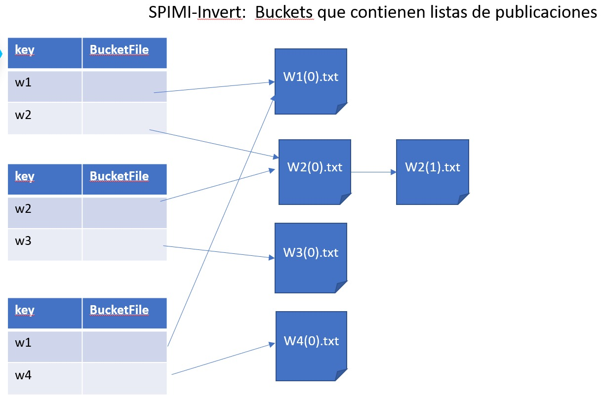
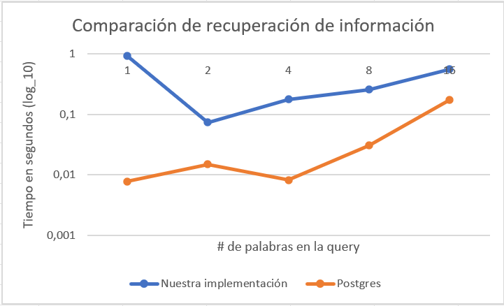
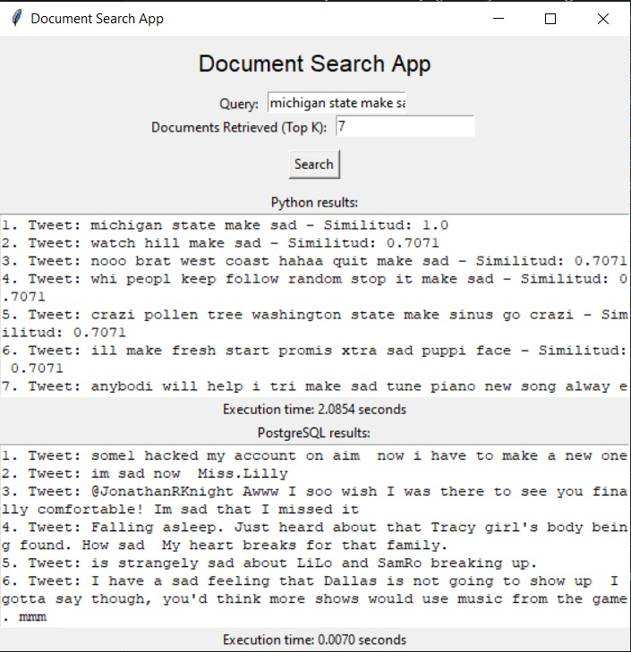

# BD2-proyecto2

Proyecto 2 del curso de Base de datos 2 en UTEC

# Integrantes

* Yared Riveros Rodriguez
* Mariajulia Romani Tafur
* Camila Rodriguez Valverde
* Luis Méndez Lázaro

---

## Descripción del dominio de datos
El dominio de datos que se escogió para este proyecto es el de Twitter. Se escogió este dominio debido a que es una red social muy popular y que tiene una gran cantidad de datos disponibles para su uso. Esta base de datos, en particular, fue utilizada para hacer un análisis de sentimientos de los tweets. Para esto, se utilizó un dataset que contiene tweets en inglés, los cuales están clasificados como positivos o negativos. Sin embargo, para este proyecto, se hizo una limpieza de los datos ya que lo que se necesitaba eran los tweets en sí, sin la clasificación de sentimientos. Por lo tanto, quedó un dataset con 4 columnas: id,user,text,processed_text (el cual es el texto del tweet sin stopwords). Se utilizaron 10k tweets para este proyecto.

---

## Backend

### Construcción del índice invertido

Se utilizo la estrategia SPIMI-invert para la construcción del índice invertido. En el archivo main.py se genera el índice invertido, que crea para cada keyword su respectivo archivo .pkl. En estos archivos, se guardan los pares (tweet, TF-IDF en dicho tweet). Para esto, se recorre el dataset y se calcula el TF-IDF de cada término en cada tweet. Luego, se guarda en el archivo .pkl el par (tweet, TF-IDF) para cada término. Si se desea ver el proceso de creación del índice invertido, se puede ejecutar el archivo main.py. Finalmente, si quiere ver el contenido de los archivos .pkl, se puede ejecutar el archivo verPickles.py.



### Manejo de memoria secundaria
Para el manejo de memoria secundaria, se utilizó la librería pickle de Python. Esta librería permite guardar objetos en archivos .pkl, los cuales pueden ser leídos posteriormente. La creación de estos archivos se realiza una vez ya que  esto puede tardar un tiempo considerable, ya que se tienen que recorrer todos los tweets y calcular el TF-IDF de cada término en cada tweet.

### Ejecución de consultas

En el archivo consultas.py, se ingresa la consulta y preprocesa la query para que los términos tengan el mismo formato que los términos guardados en el índice invertido. Luego, busca cada uno de esos términos en su respectivo archivo .pkl y extrae los pares (tweet-TF-IDF) almacenados. Por último, ya obtenidos los pares y la query en vectores distintos, se halla la similitud coseno de ambos de tal forma que se obtiene un puntaje para cada tweet.

---

## Frontend
### Diseño del índice con Postgres
Se creo el índice tweet_search_idx en Postgres con el siguiente comando:

```sql

CREATE INDEX tweets_search_idx ON tweets USING gin(text gin_trgm_ops);

```

En el archivo GIN.sql se muestra la creación de las tablas que contienen los tweets para poder realizar consultas.

Luego, se crea el índice GIN para la columna text de la tabla tweets. Este índice permite hacer búsquedas de texto completo más rápidamente. Para esto, se utilizó la extensión pg_trgm de Postgres. 

### Análisis comparativo con su propia implementación

Se realizó un análisis comparativo entre la búsqueda de texto completo con índices GIN y la búsqueda de texto completo con índices invertidos. Para esto, se tomo como número de palabras por tweet de potencia de 2, desde 2^0 hasta 2^4. 



Se observa siempre una mayor tiempo de búsqueda a nuestra implementación. Esto se debe a que la búsqueda con índices GIN es una búsqueda de texto completo, mientras que la búsqueda con índices invertidos es una búsqueda de texto parcial. Por lo tanto, la búsqueda de texto completo con índices GIN es más rápida que la búsqueda de texto completo con índices invertidos.

### GUI
Se utilizó la interfaz tkinter de Python para crear la GUI. En esta interfaz, se puede ingresar la consulta y el top k que se quiere. De este modo, se obtiene una lista de tweets ordenados de acuerdo a su puntaje. Para esto, se utilizó el archivo consultas.py. Para ejecutar la GUI, se debe ejecutar el archivo frontend.py.

